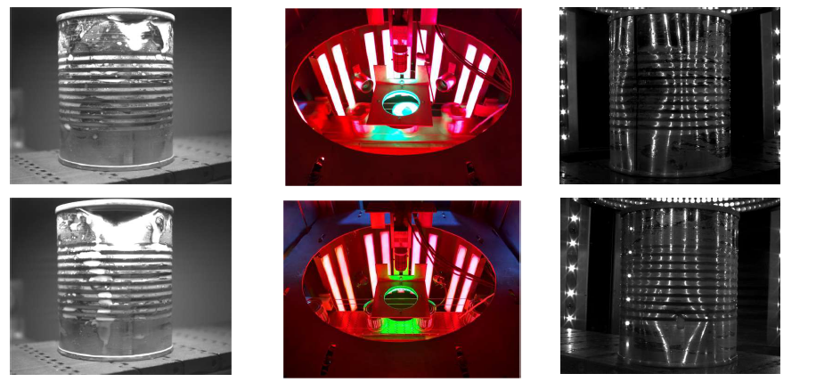
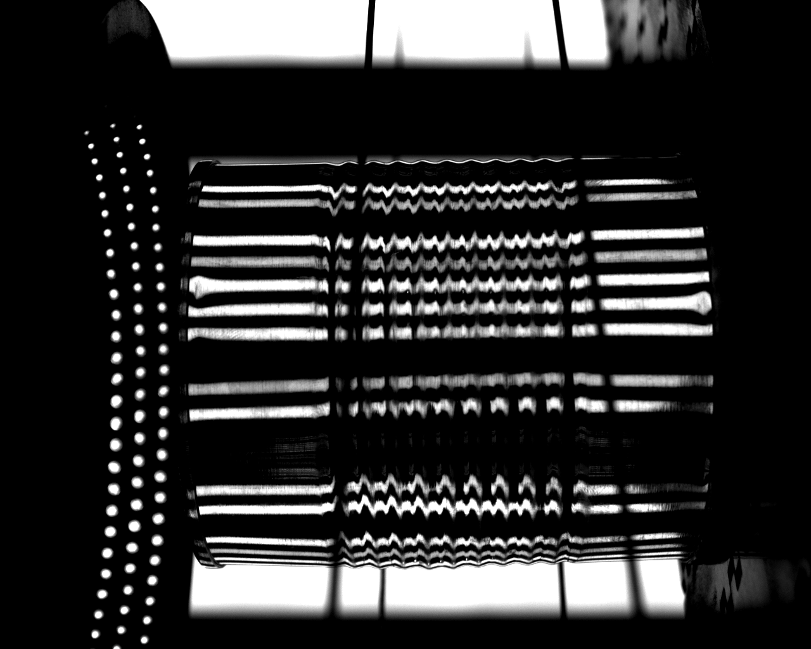
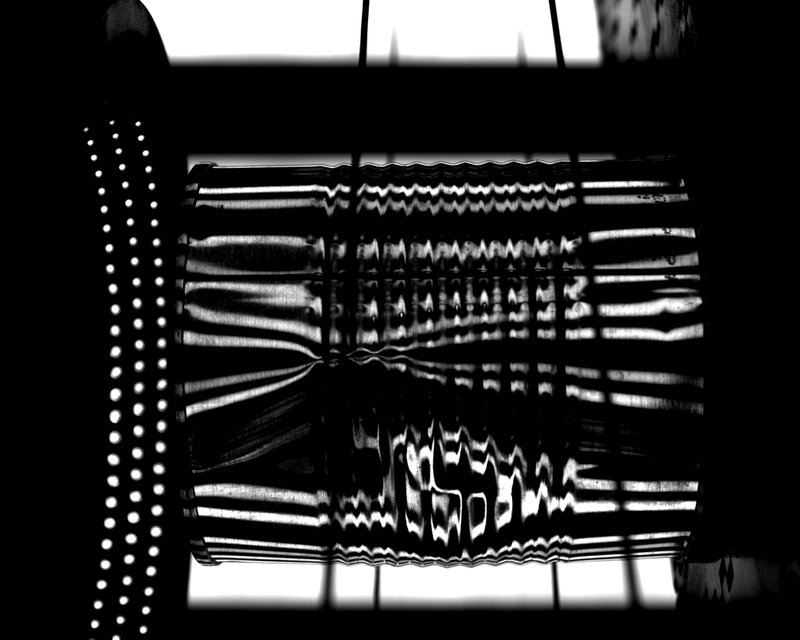

# Inspector_integridad_latas
# Inspector de integridad de latas Utilizando Deep learning
En el marco de la realizacion del curso prediccion por medio de imagenes utilizando deep learning , se realiza un prototipo de clasificacion, dicho prototipo fue entrenado utilizando imagenes adquiridas en la empresa que trabajo actualmente conocida como INTECOL SAS , el objetivo del proyecto es clasificar latas buenas y latas malas, Intecol realizo una arquitectura compuesta por iluminacion , 4 camaras adecuadas y un sistema expulsor:
#### Sistema optico utilizado
</img> 

las imagenes adquiridas por el sistema se pueden observar a continuacion:

##### Imagen buena
</img>

##### Imagen Mala
</img>

Actualmente el sistema utiliza un algoritmo de vision artificial que funciona con operaciones basicas de imagenes, tales como threshold , filtros , adquisicion de caracteristicas tales como area , angulo , en donde se analiza cada una de las lineas que se ven en las latas , y  con condicionales se logra clasificar la lata como buena/mala .

El proyecto pretende utilizar dichos algoritmos para generar un dataset de mas de 20000 imagenes para llevar a cabo la
clasificacion de las imagenes mediante uso de deep learning.

Se utilizaron diferentes modelos, tanto propios como modelos descargados para realizar la classificacion, este notebook tiene como fin demostrar los resultados del entrenamiento hecho en los notebook "proyecto_prediccion","deep1" ,"deep2" y "deep3" se realizaron varios entrenamientos, los modelos con los pesos entrenados se encuentran guardados en la carpeta "models", este notebook muestra el desempeño de uno de esos modelos.
